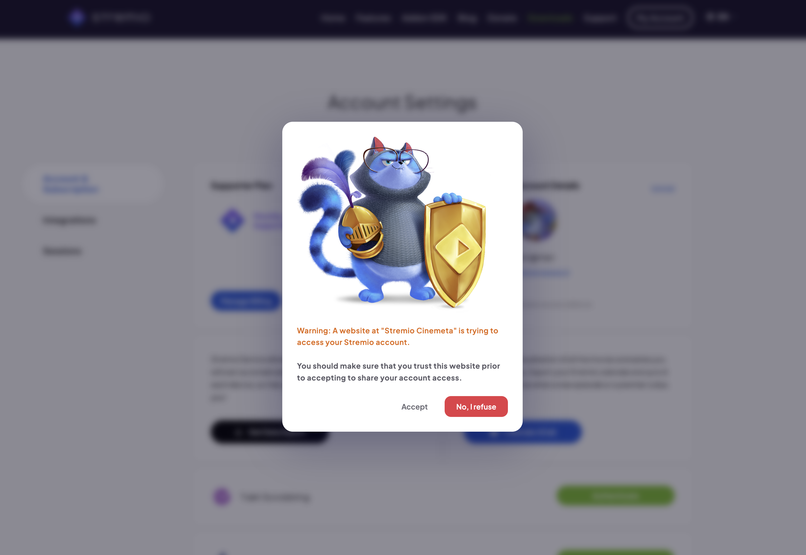
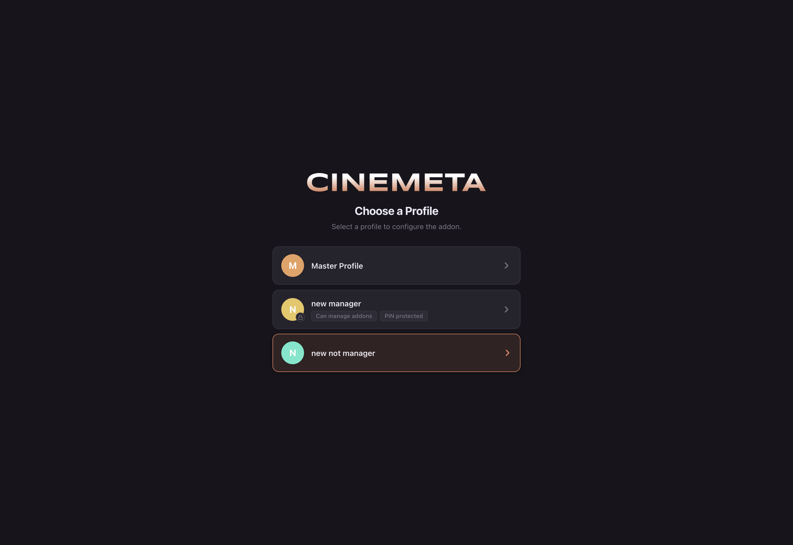
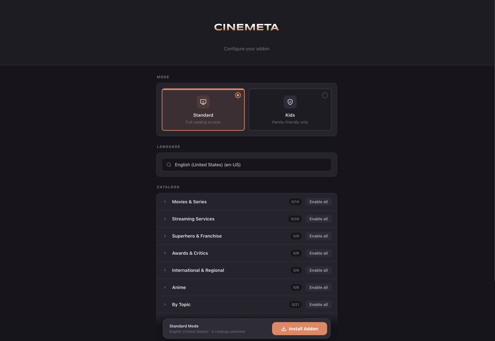
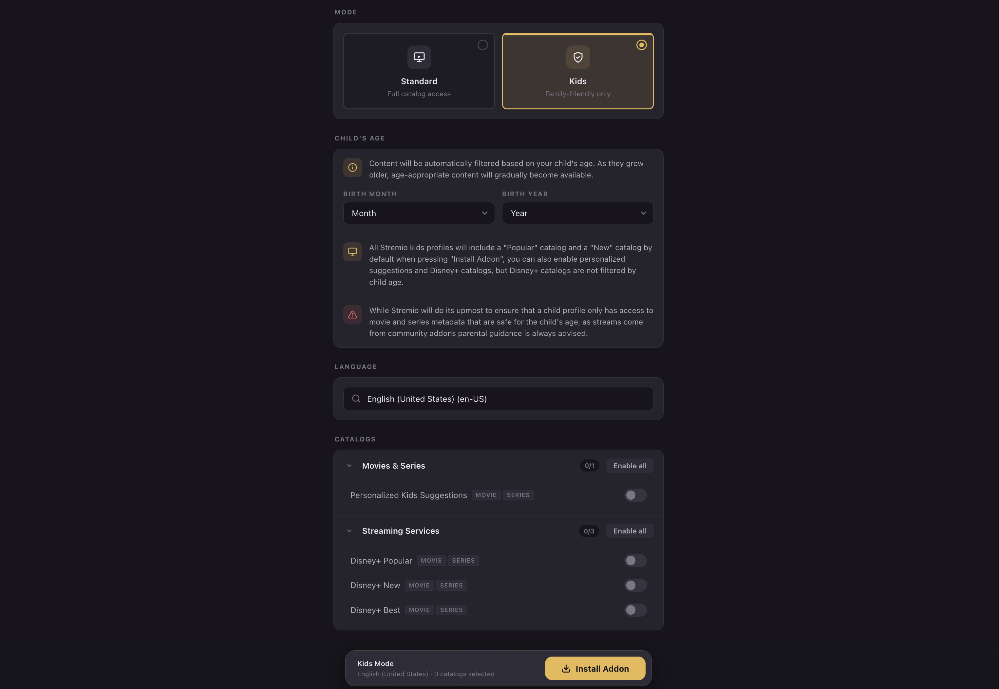

# Cinemeta Configuration

> Supporters-only configuration for Stremio's built-in catalogs.

**Available on:** All platforms (configured once, applies to your whole account)

## What it does

Cinemeta is Stremio's official metadata and catalog add-on — the source of the
posters, descriptions and discovery rows you see across the app. Supporters can
**configure** it with options that aren't available on the standard add-on:

* **Custom catalogs & recommendations** — pick exactly which Cinemeta catalogs
  appear in your discovery rows, from dozens grouped by theme.
* **Tuned to your taste** — personalized rows like **Personalized Suggestions**,
  **Watched in Your Area**, **Liked by Me** and **Loved by Me**, built from what
  you've watched and rated.
* **Child-safe setups** — a **Kids Mode** that filters catalogs to
  age-appropriate content for a child's age, so a profile for younger viewers
  only ever sees what's suitable.
* **Language** — set the language Cinemeta uses for titles and metadata.

## How to set it up

1. Open **Settings → Supporters → Cinemeta Configuration**. The Cinemeta
   configuration tool opens and asks you to **Login to Stremio**.

2. **Authorize** the tool to access your account. Stremio shows a consent
   prompt — confirm it's the Cinemeta tool and accept.

3. **Choose a profile** to configure the add-on for. Each profile can have its
   own Cinemeta setup — handy for a child-safe profile alongside your own.

4. **Configure the add-on.** Pick a **Mode** (Standard or Kids), a **Language**,
   then toggle the catalogs you want — individually or **Enable all** per group
   (Movies & Series, Streaming Services, Superhero & Franchise, Awards & Critics,
   International & Regional, Anime, By Topic, and more).

5. For a child-safe setup, switch to **Kids** mode and set the **child's age**
   (birth month and year). Catalogs are filtered to age-appropriate content and
   you get kids-friendly recommendation rows.

6. Click **Install Addon.** Your configured Cinemeta is saved to your Stremio
   account, so the tuned catalogs show up on **every device** you sign into —
   Web, Desktop, Mobile and TV.

> **Note:** Because this configures an add-on tied to your account, you only set it up once.
> Pair it with [User Profiles](user-profiles.md) to give each person in your home
> their own recommendations and a child-safe profile for the kids.
