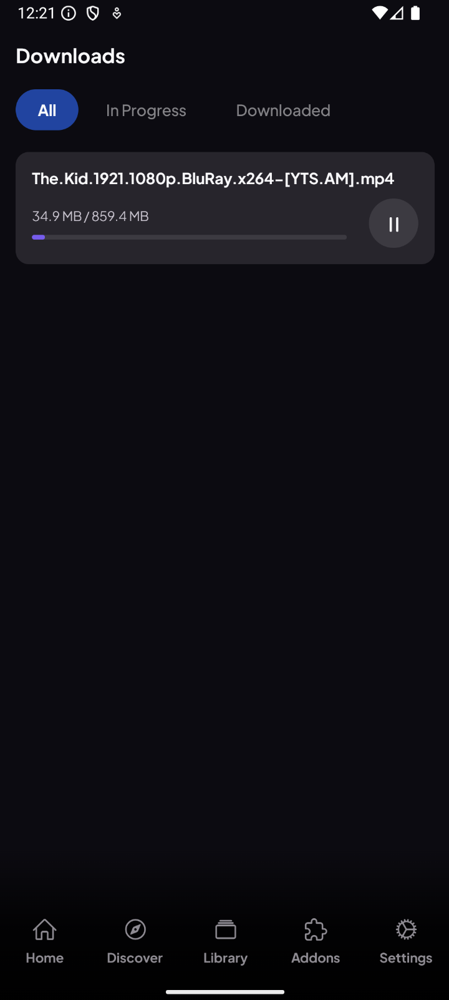
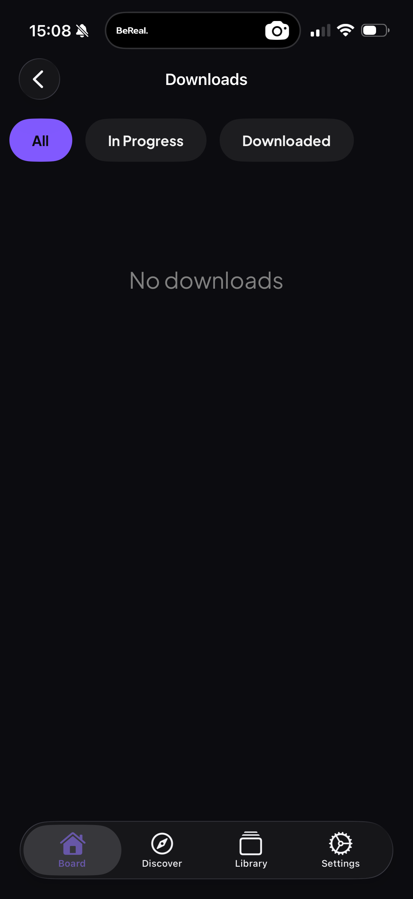

# Download Manager

> Save streams and watch them fully offline, anywhere.

**Available on:** Desktop · Mobile (Android & iOS)

## What it does

Save any stream to your device and watch it later with no connection — on a
flight, a commute, or anywhere the signal drops. The **Downloads** page is your
hub for everything you've saved: live progress, speed, and full control over
each file.

You can:

* **Download** a stream straight from a title's stream list or the player.
* **Pause and resume** downloads at any time.
* **Play offline** once a download finishes.
* **Delete** downloads you no longer need to free up space.

## How to start a download

1. Open a movie or episode and pick a stream, **or** start playing it.
2. Use the **Download** action on the stream (or in the player's options menu).
3. The download appears on the **Downloads** page with a live progress bar,
   speed, and how much of the file has been saved.

## Managing your downloads

The Downloads page lists everything you've saved. Each item shows its progress
and gives you Pause/Resume, Play and Delete controls. Search and sort to find a
specific download quickly.

On mobile the same controls travel with you, so your offline library is ready on
the go. The Downloads page filters by **All**, **In Progress** and
**Downloaded**:

> **Note:** Downloads need the Stremio streaming server running on your device — it's
> built into the Desktop and mobile apps. Downloads aren't available on TV.
