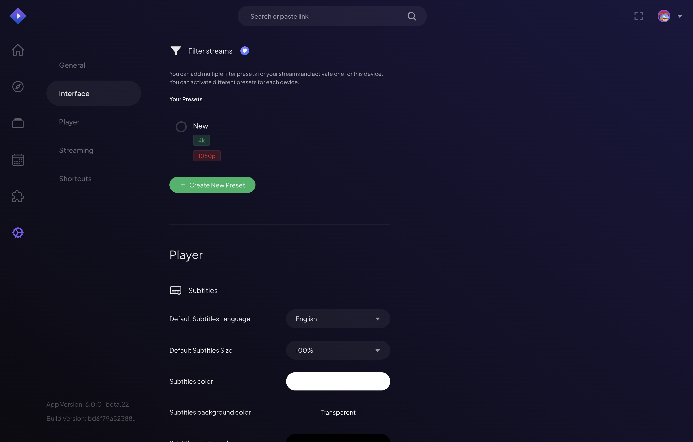
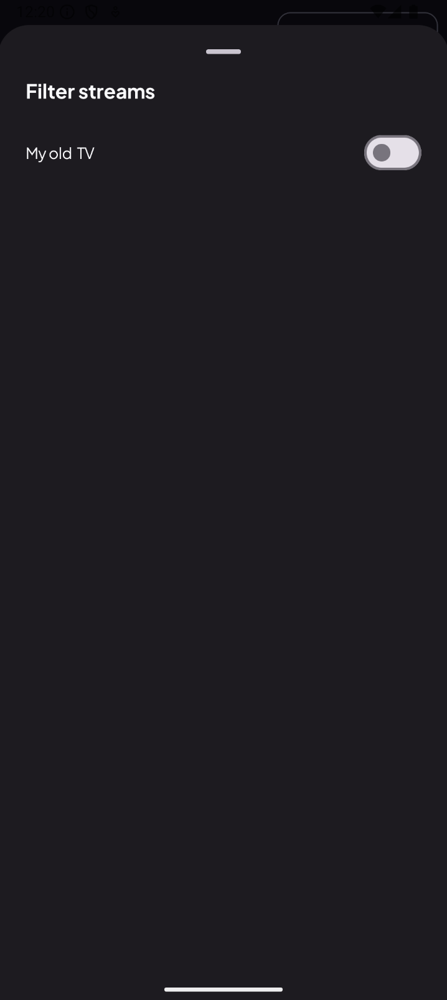
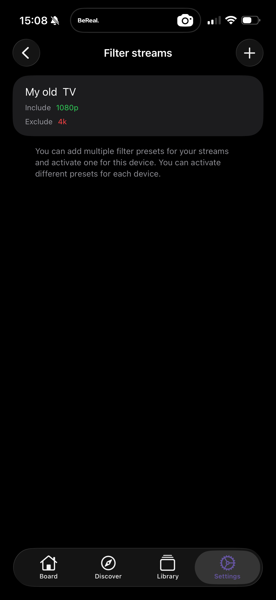
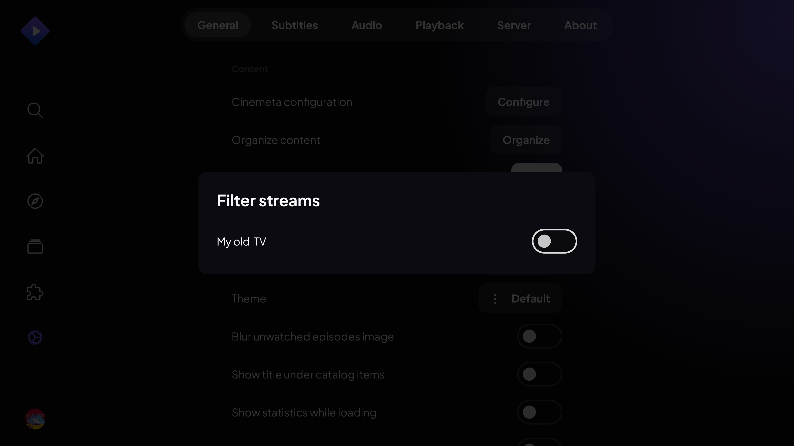

# Filter Streams

> Filter streams by quality, source and more — see only what matters.

**Available on:** All platforms

## What it does

When an add-on returns dozens of streams for one title, most of them aren't what
you want. **Stream presets** cut the list down to only the streams worth seeing.

A preset is a named filter you build from tags:

* **Include** tags — only show streams that match, e.g. `4k`, `1080p`,
  `bluray`.
* **Exclude** tags — hide streams you never want, e.g. `cam`, `telesync`,
  `hdts`.

Build presets like **"4K only"**, **"No cams"** or **"HD Bluray"**, then select
one to apply it. Only the selected preset is active at a time, and each device
can have its own selection — your TV can stay on **"4K only"** while your phone
runs **"Data saver"**.

## How to use it

1. Open **Settings → Streaming → Stream Presets**.
2. Create a preset, give it a name, and add **Include** and **Exclude** tags
   (tap the common ones or type your own).
3. **Select** the preset to make it active. From then on, stream lists only show
   what matches.

On mobile, presets are managed the same way — here a **"My old TV"** preset
includes `1080p` and excludes `4k`, active just for that device:

On TV you **select** from the presets you've already created:

> **Note:** Create and edit presets on Web, Desktop or Mobile. TVs let you pick from your
> existing presets — build them once on a phone or computer and they sync across.
