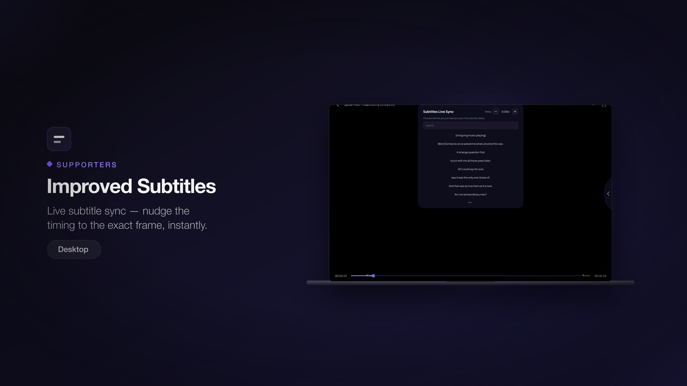
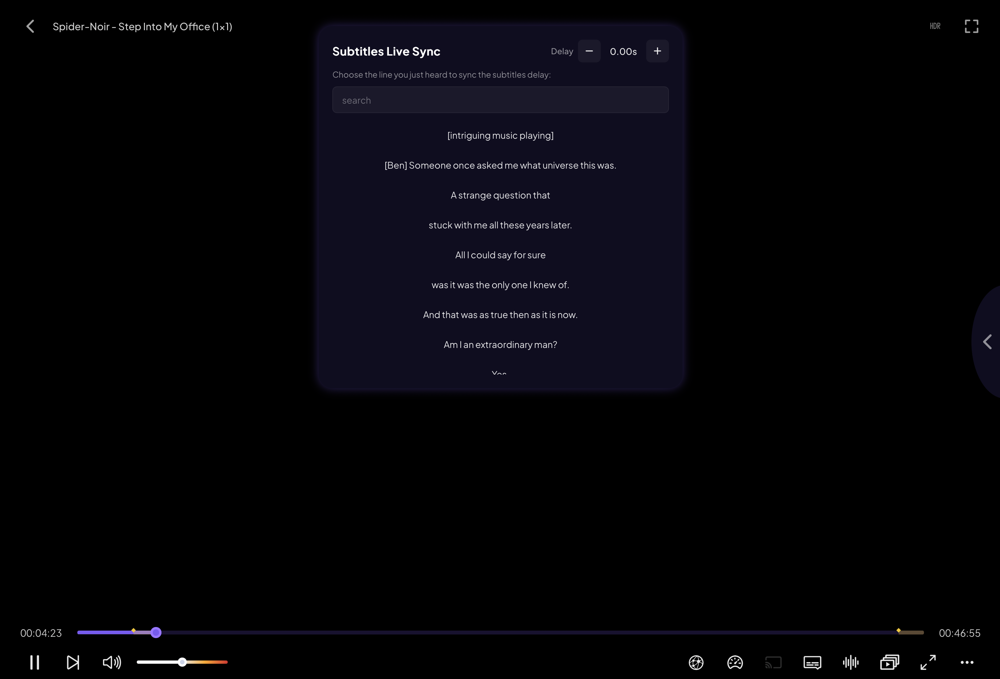

# Improved Subtitles

> Live subtitle sync — nudge the timing to the exact frame, instantly.

**Available on:** Desktop

## What it does

Subtitles that drift out of sync are the fastest way to ruin a film. Supporters
get **live subtitle sync**: adjust the timing while the video plays and see the
result immediately, down to the frame.

There are two ways to line subtitles up:

* **Nudge the delay** — step the timing forward or back in small increments
  until the words match the mouths. The current offset is shown as you adjust
  (for example `-0.25s`, `+1.50s`).
* **Sync to a line** — search the subtitle text for a line of dialogue you can
  hear, then tap it. Stremio locks that line to the moment it's spoken and the
  rest of the track falls into place.

## How to use it

1. Open the **Subtitles** menu in the player.
2. Choose **Live Sync**.
3. Either tap the **+ / −** controls to nudge the timing, or search for a line
   you just heard and tap it to anchor the track.
4. Close the menu — your adjusted timing stays applied for the rest of the
   stream.

> **Note:** More subtitle improvements are [on the roadmap](../roadmap.md), including
> automatic syncing.
