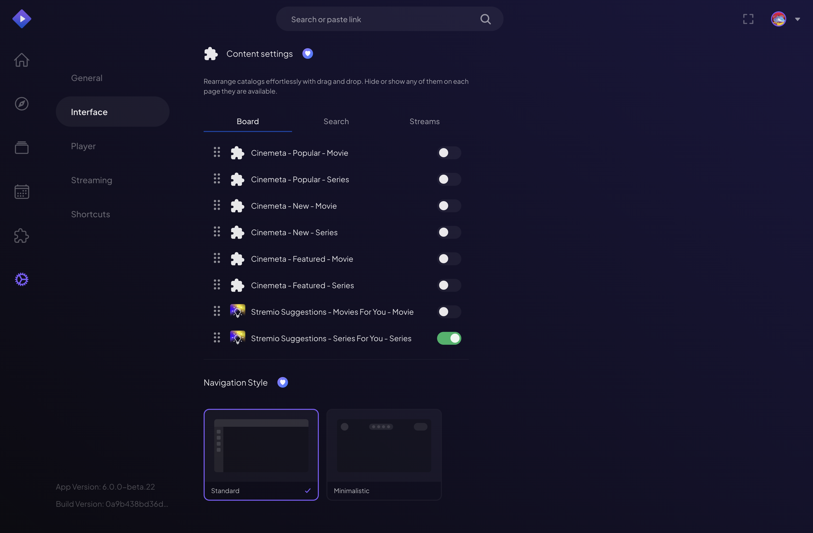
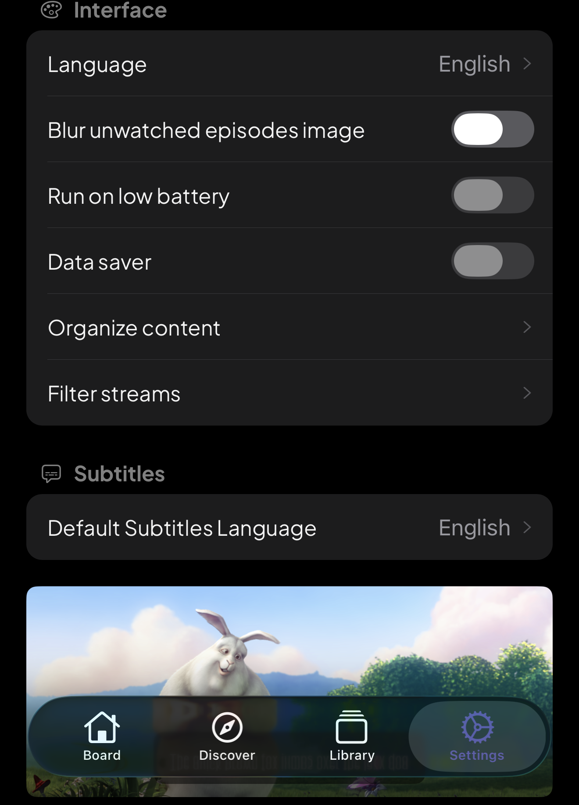
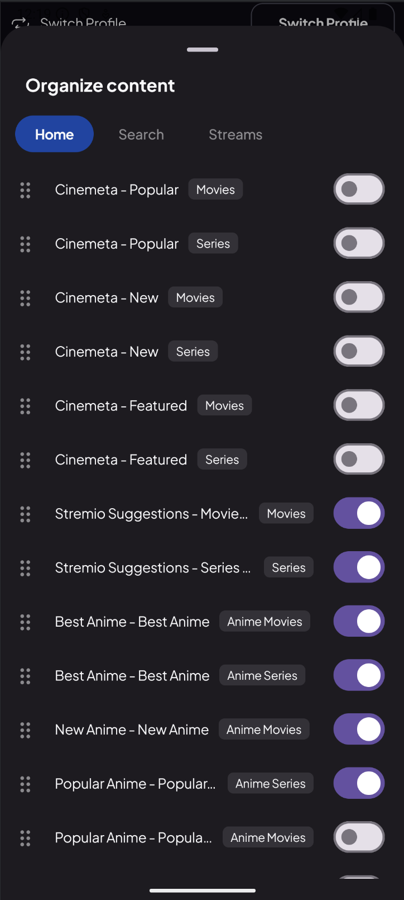
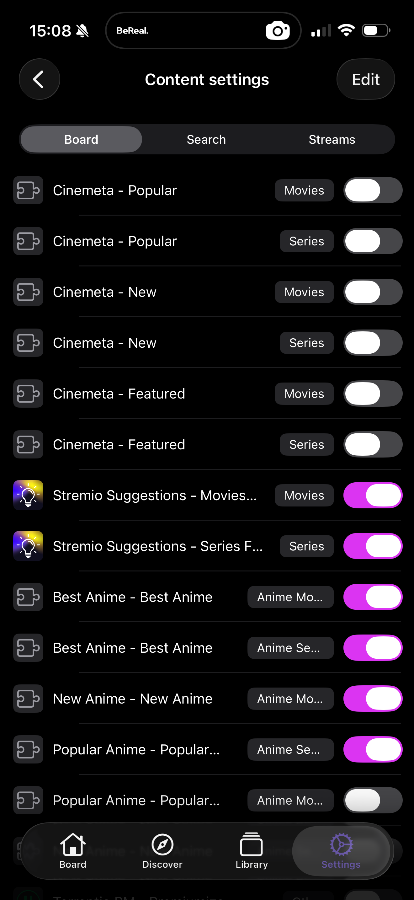

# Organize Content

> Make every page yours — reorder, hide and rename catalogs.

**Available on:** All platforms

## What it does

Your add-ons decide which catalogs appear in Stremio. **Organize Content** lets
you decide how they're arranged. For each page you can:

* **Reorder** catalogs — drag the rows you care about to the top.
* **Hide** catalogs — remove clutter and duplicates you never use.
* **Rename** catalogs — give a row a title that means something to you.

It applies across the pages where catalogs show up:

* The **Board** (your home page)
* **Search**
* The **stream** lists on a title's detail page

## How to use it

1. Open the content settings from **Settings → Interface → Organize content**,
   or from the menu on the Board.

2. Pick the page you're organizing (Board, Search or Streams).
3. **Drag** to reorder, toggle the **eye** to hide or show, and tap a title to
   **rename** it.
4. Your layout saves to your account and applies everywhere you use Stremio.

It travels to mobile and, importantly, to the TV — where a tidy, personal layout
makes the biggest difference. Toggle catalogs on or off per page (Board, Search,
Streams):

> **Note:** Your TV displays the layout you build, even though you set it up on a phone or
> computer. Because everything syncs to your account, your Board looks the same on
> every screen.
