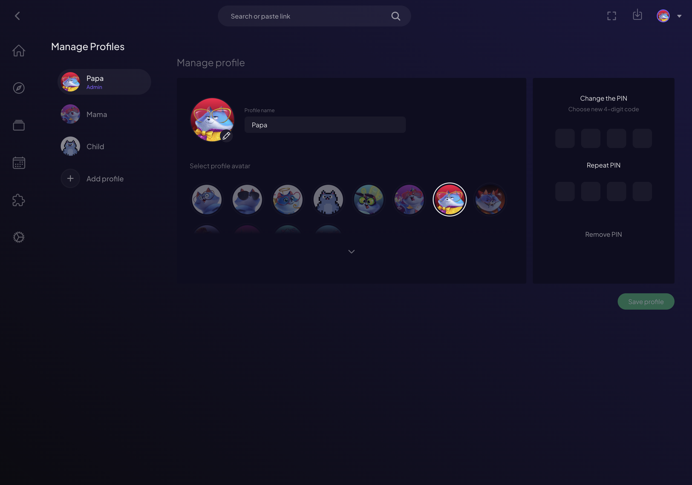
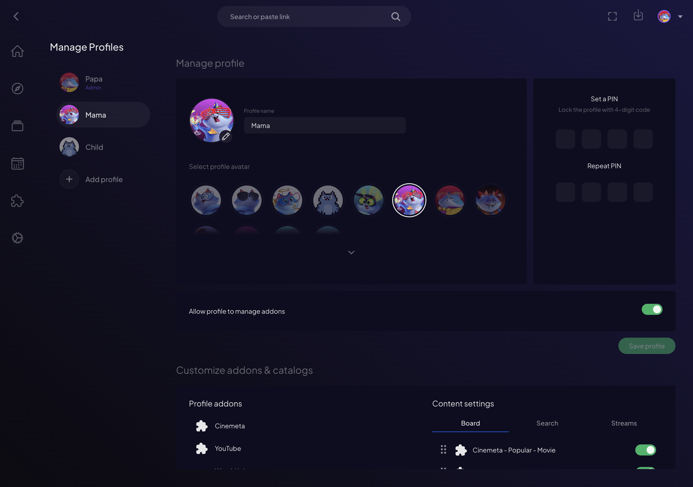
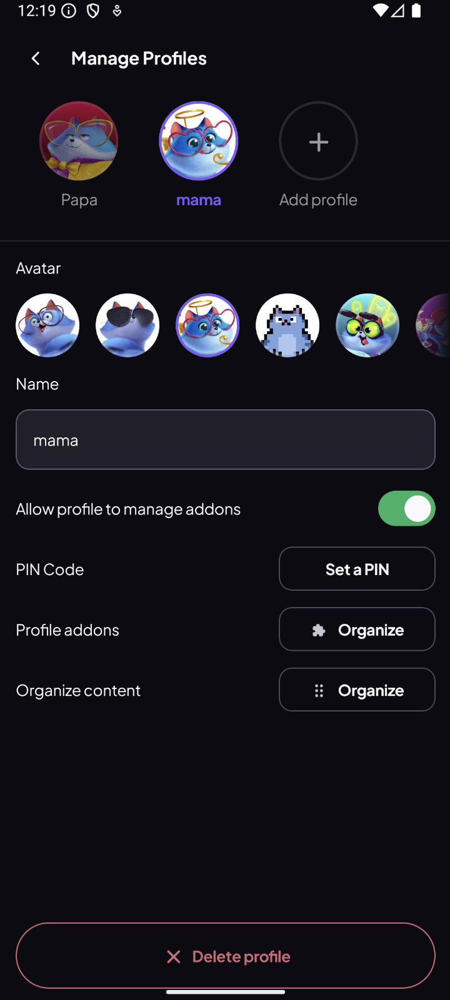

# Profiles Management

> Create, customize and PIN-protect every profile.

**Available on:** Desktop · Mobile (selection and switching works everywhere — see [User Profiles](user-profiles.md))

## What it does

The account owner manages every profile from one place. From the management
screen you can:

* **Create** new profiles for the people in your home.
* **Name** each profile and give it an **avatar**.
* **Set a PIN** to keep a profile private.
* **Control add-on permissions** — decide whether a profile can install and
  remove its own add-ons, or stick to a curated set.
* **Clone add-ons** from the main account when creating a profile, so a new
  profile starts ready to go.
* **Edit or delete** profiles at any time.

## How to use it

Everything lives under the **Supporters** menu — **Switch Profile**, **Manage
Profiles**, **Add-ons** and **Downloads** are all one tap from the home screen:

1. Open **Settings → Supporters → Manage Profiles** (the account owner only).
2. Tap **Add profile**, then set a name, pick an avatar, and optionally set a
   PIN and choose whether the profile can manage its own add-ons.

3. Save. The new profile immediately appears on the **Who's watching?** screen
   on every device.
4. To change a profile later, select it here and edit its name, avatar, PIN or
   permissions — or remove it.

Full management is available on Desktop and mobile:

> **Note:** TVs use the profiles you create here but don't edit them — set everything up
> once on a phone or computer and it syncs to the TV automatically.
