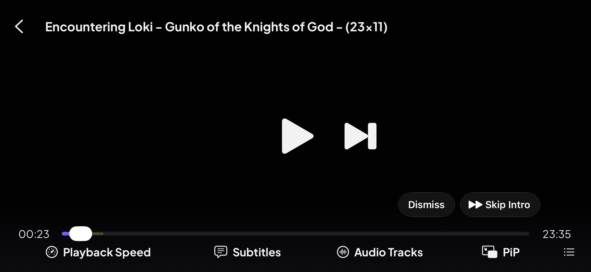

# Skip Intro & Outro

> Jump past recaps and credits with a single tap.

**Available on:** All platforms — Web · Desktop · Mobile · TV · VR

## What it does

When you reach the opening or closing credits of an episode, a **Skip** button
appears in the player at exactly the right moment. One tap jumps you straight
past the intro, recap or end credits — no scrubbing, no guessing.

The timing for each intro and outro is provided by Stremio, so the button shows
up at the precise frame the skippable segment begins and disappears once it's
over.

## How to use it

1. Start watching an episode.
2. As the intro (or outro) begins, a **Skip Intro** / **Skip Outro** button
   slides into the corner of the player.
3. Tap it to jump to the end of that segment. Ignore it and it quietly fades
   after a few seconds so it never covers the action.

The same one-tap **Skip Intro** button sits in the standard player controls too:

It works in the VR app too — skip the credits without reaching for a
controller.

> **Note:** Pairs naturally with binge-watching: skip the credits, and Stremio rolls into
> the next episode for you.
