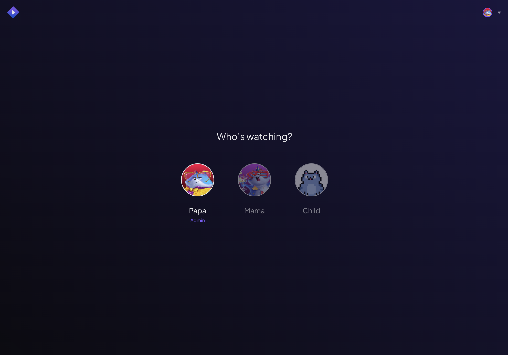
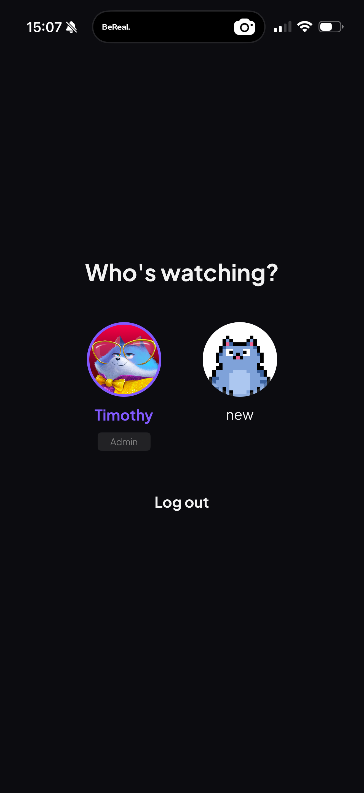
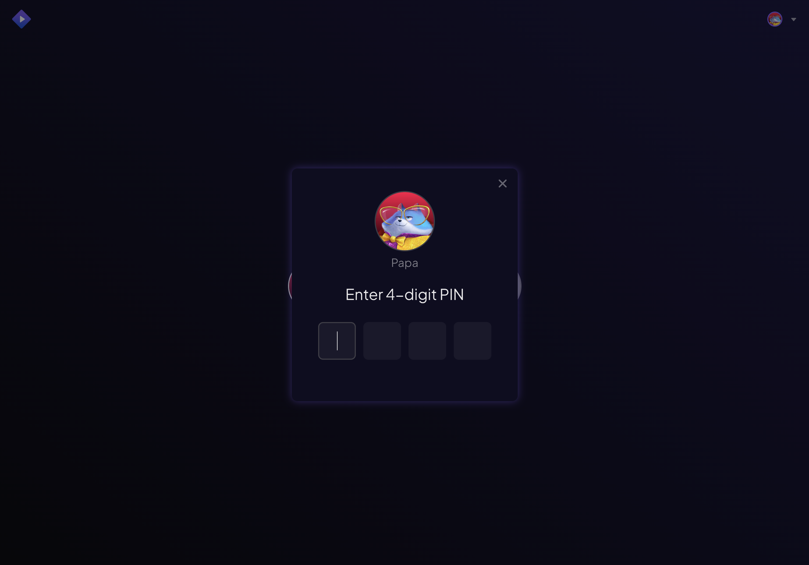
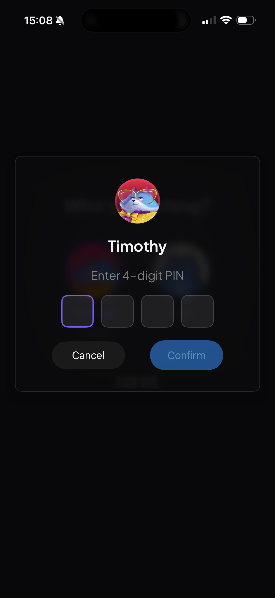
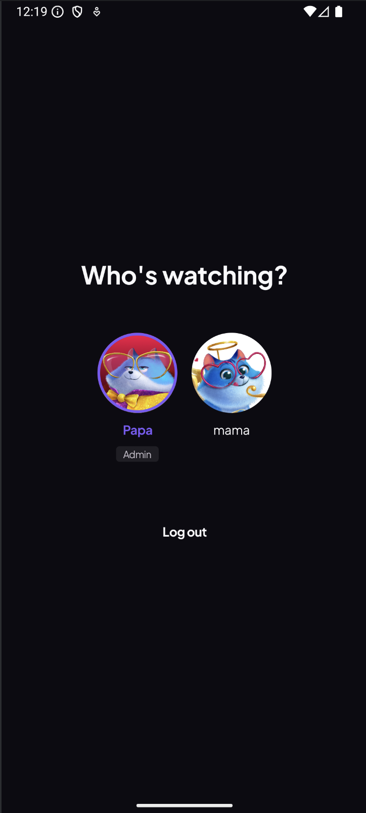
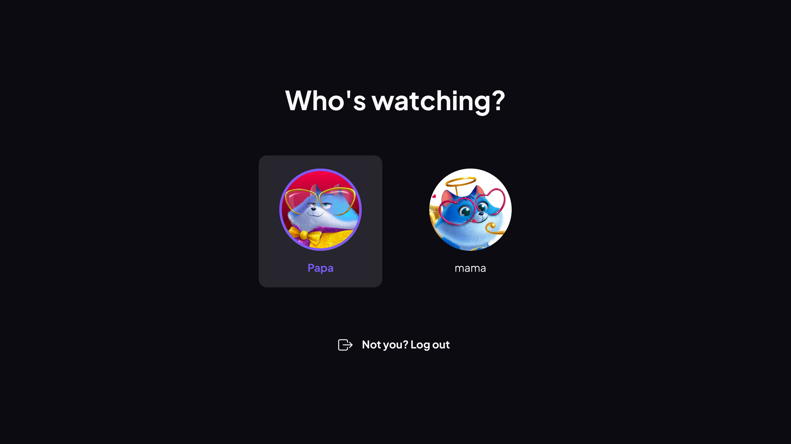

# User Profiles

> A separate, personal space for everyone in your home.

**Available on:** All platforms

## What it does

One Stremio account, a profile for each person. Every profile is its own space —
its own add-ons, its own content layout, its own recommendations — so what one
person watches never clutters anyone else's discovery rows.

When you open Stremio, you pick **who's watching** and land straight in your own
setup. PIN-protected profiles stay private; child profiles stay safe.

The same screen on mobile — an **Admin** profile and a second profile, each with
its own avatar:

## How to use it

1. On launch (or from the profile switcher), choose your profile from the
   **Who's watching?** screen.
2. If the profile is PIN-protected, enter its 4-digit PIN.

3. You're in your own space — your add-ons, your catalogs, your recommendations.

Switching profiles works the same way everywhere — Web, Desktop, Mobile and TV:

> **Note:** Selecting and switching profiles works on every platform. Creating, editing and
> PIN-protecting them is done in [Profiles Management](profiles-management.md) on
> Desktop or mobile.
